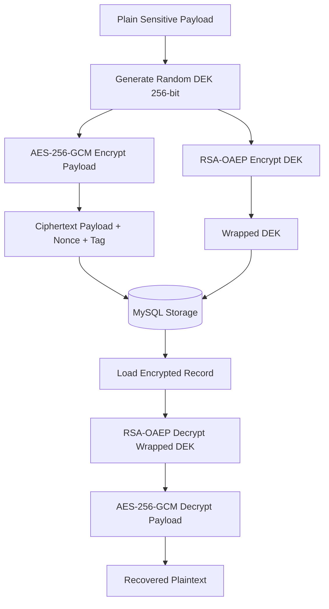
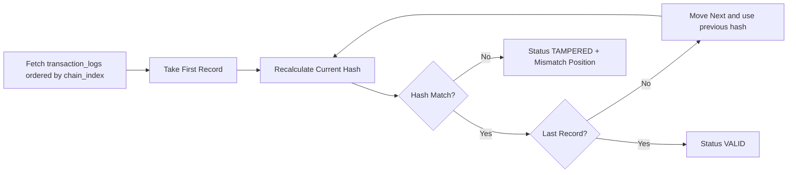
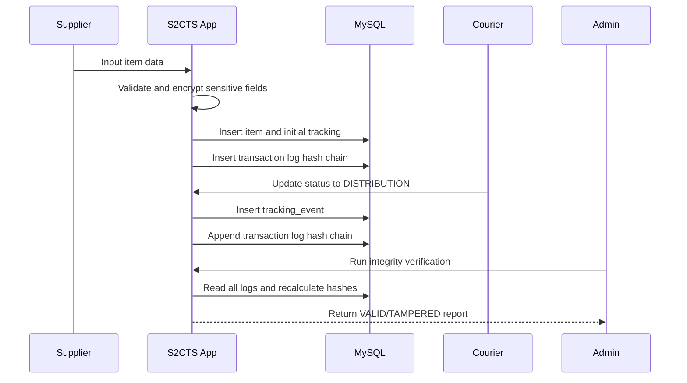

# Diagram Pendukung (Mermaid)

## 1. BPMN Sederhana Proses Supply Chain Aman

```mermaid
flowchart LR
    A[Supplier Input Barang] --> B[Validasi Data]
    B --> C[Encrypt Data Sensitif]
    C --> D[Create Log Hash Chain]
    D --> E[Status Warehouse]
    E --> F[Kurir Update Distribution]
    F --> G[Append Log Hash Chain]
    G --> H[Status Customer Received]
    H --> I[Admin Integrity Verification]
    I --> J[Generate Audit Trail and PDF Report]
```

## 2. Alur Hybrid Encryption

```mermaid
flowchart TD
    A[Plain Sensitive Payload] --> B[Generate Random DEK 256-bit]
    B --> C[AES-256-GCM Encrypt Payload]
    B --> D[RSA-OAEP Encrypt DEK]
    C --> E[Ciphertext Payload + Nonce + Tag]
    D --> F[Wrapped DEK]
    E --> G[(MySQL Storage)]
    F --> G

    G --> H[Load Encrypted Record]
    H --> I[RSA-OAEP Decrypt Wrapped DEK]
    I --> J[AES-256-GCM Decrypt Payload]
    J --> K[Recovered Plaintext]
```

## 3. Alur Integrity Verification

```mermaid
flowchart LR
    A[Fetch transaction_logs ordered by chain_index] --> B[Take First Record]
    B --> C[Recalculate Current Hash]
    C --> D{Hash Match?}
    D -- Yes --> E{Last Record?}
    E -- No --> F[Move Next and use previous hash]
    F --> C
    E -- Yes --> G[Status VALID]
    D -- No --> H[Status TAMPERED + Mismatch Position]
```

## 4. Sequence Diagram Perubahan Status

```mermaid
sequenceDiagram
    participant S as Supplier
    participant APP as S2CTS App
    participant DB as MySQL
    participant C as Courier
    participant A as Admin

    S->>APP: Input item data
    APP->>APP: Validate and encrypt sensitive fields
    APP->>DB: Insert item and initial tracking
    APP->>DB: Insert transaction log hash chain

    C->>APP: Update status to DISTRIBUTION
    APP->>DB: Insert tracking_event
    APP->>DB: Append transaction log hash chain

    A->>APP: Run integrity verification
    APP->>DB: Read all logs and recalculate hashes
    APP-->>A: Return VALID/TAMPERED report
```
